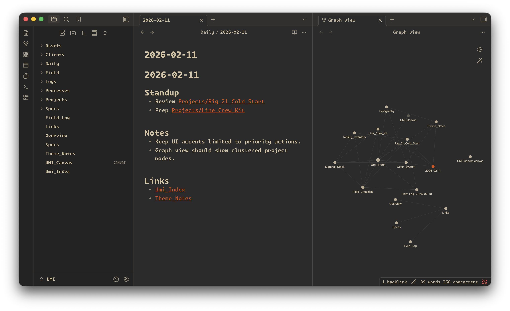
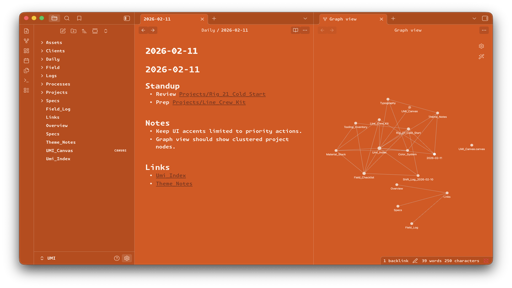

# Utility Materials — Obsidian Theme

Utility Materials–inspired Obsidian theme built for dense notes, technical writing, and system thinking.

Dark greys. High contrast. Restrained orange.





---

## Overview

This theme is modeled after the visual language of [Utility Materials](https://utility.materials.nyc), a New York–based clothing brand focused on technical workwear and industrial design.

It carries the same principles:

- High signal, low noise  
- Dense materials and tight spacing  
- Strong hierarchy  
- Controlled accent color for intent, not decoration  

The orange is not a flourish. It is a status light.

---

## Design Principles

- **Legibility first.** Designed for long-form writing and technical notes.
- **Contrast as structure.** Dark surfaces with precise separation between panels.
- **Minimal chrome.** Interface elements recede. Content holds weight.
- **Accent discipline.** Orange appears only where meaning changes: links, highlights, selection states.

No gradients. No glow. No ornamental softness.

---

## Install (Local)

1. Copy this folder into your vault at:
```
.obsidian/themes/
```

2. In Obsidian, go to:

Settings → Appearance → Themes

3. Select **Utility Materials**.

---

## Font

This theme expects **Monaspace Krypton Frozen** to be installed locally:

https://github.com/githubnext/monaspace

If unavailable, it falls back to other Monaspace variants or your system `monospace`.

The spacing and weight balance are tuned around Monaspace. Install it for intended density and rhythm.

---

## Color System

- **Primary surfaces:** Dark greys, low reflectivity  
- **Text:** High-contrast neutral  
- **Accent:** Industrial orange (restricted usage)

The accent is designed to feel infrastructural, not expressive. It should read like a warning stripe or grid indicator.

---

## Related Utility Materials Themes

For consistency across tools:

- VSCode / Cursor  
https://marketplace.visualstudio.com/items?itemName=Utility-Materials.utility-materials-theme  

- Blender  
https://extensions.blender.org/themes/utility-materials/

---

## Credits

Based in part on the Wasp Obsidian Theme by Santi Younger:  
https://github.com/santiyounger/Wasp-Obsidian-Theme

---

Built for operators.

Powering what humanity is destined for.
